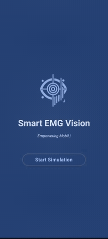
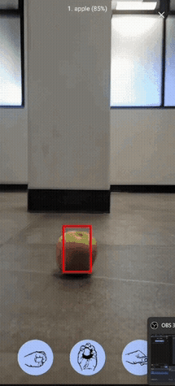

# Welcome to SmartEMG Vision 🦾

[](https://kotlinlang.org/)
[](https://developer.android.com/jetpack/compose)
[](https://www.python.org/)
[](https://www.tensorflow.org/)

Welcome to the **SmartEMG Vision** repository. This is an Android application prototype for assistive interaction. It combines EMG signal classification with computer vision to support object-aware action suggestions based on simulated grasp predictions.

This project was developed at the **Instituto Politécnico Nacional** as a team prototype for accessible technology.

<div align="center">
  <table align="center">
    <tr>
      <td align="center">
        
      </td>
      <td align="center">
        
      </td>
      <td align="center">
        
      </td>
    </tr>
  </table>
</div>

---

## 📚 About The Project

| Feature                | Details |
| ---------------------- | ------- |
| 🎯 **Purpose**         | A prototype for assistive interaction using EMG signal classification and object detection. |
| ⚙️ **Architecture**     | Client-Server architecture. The Android app sends camera frames and commands via HTTP to local Python servers running the AI models. |
| 🧠 **Model Integration** | Uses a TensorFlow/Keras model for EMG signal classification and YOLOv8 for object detection. |
| 🔄 **Core Operations** | Real-time camera feed analysis, bounding box rendering, simulated EMG signal processing, and contextual UI action suggestions. |

---

## 🚀 Tech Stack

### Android & UI


- **Kotlin & Jetpack Compose:** Used to build the main interface, camera view, and response-driven UI states.
- **CameraX:** Captures real-time image frames from the device camera for continuous analysis.
- **OkHttp:** Manages asynchronous multi-part HTTP requests to send image frames and receive predictions from the backend.

### Backend & AI Models


- **Python & Flask:** Two local servers (`server.py` and `smg_predict.py`) process image frames and EMG-related requests, then return JSON responses.
- **Ultralytics YOLOv8:** Processes incoming JPEG frames to detect and locate specific object classes.
- **TensorFlow & Scikit-learn:** A trained `.keras` model classifies simulated EMG signals into grasp types using standardized input data.

---

## 🔧 Highlighted Features

| Feature | Description |
|--------|------------|
| **Object Detection** | Detects objects from the camera feed and displays bounding boxes with confidence scores. |
| **Action Suggestions** | Shows suggested actions based on detected objects. |
| **EMG Simulation** | Sends simulated EMG-related input to the backend for grasp prediction. |
| **Prediction Feedback** | Displays whether the predicted movement matches the expected action. |

---

## 🛠️ How to Run Locally

### 1. Backend Setup (Python)

```bash
git clone https://github.com/MexboxLuis/SMARTEMG-Vision.git
cd SMARTEMG-Vision/app/src/main/java/com/example/smartemgvision/model
```

### 2. Install Python dependencies

```bash
pip install flask ultralytics numpy opencv-python pandas tensorflow scikit-learn
```

### 3. Start local servers

```bash
python server.py
```

```bash
python smg_predict.py
```

---

### 4. Android App Setup

- Open Android Studio and load the project.
- Sync Gradle files.
- Run on emulator or device.
- Grant camera permissions.


---

## 🔗 Resources

[](https://youtube.com/shorts/Idbu6ab0FtU?feature=share)
[](docs/SmartEMG_Vision_Poster.pdf)

---

## 🤝 Team

[](https://github.com/MexboxLuis)
[](https://github.com/uumaaa)